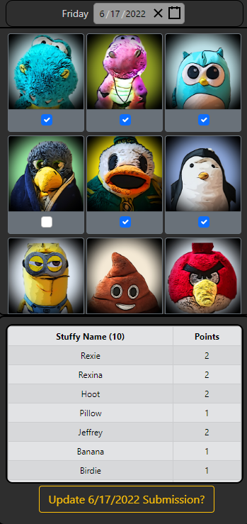
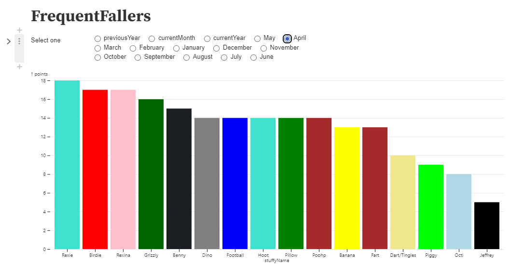

# Frequent Fallers

## Table of contents

- [General info](#general-info)
- [Usage](#usage)
- [Features](#features)
- [Status](#status)
- [Credits](#credits)

## App Snapshot

## Results Snapshot

## General Info

This project was started with starter code from `react-create-app` and further developed using Javascript / HTML / CSS for state behavior modificaitons. `Bootstrap` was used for styling.

## Usage

Frequent Fallers is a tracking app that allows users to log dates of a stuffy fall. In context, a stuffy fall is when a stuffed animal, or "stuffy" has fallen off the bed overnight. During the following day, the user then tracks which stuffies have fallen using the frequent fallers webapp. Currently, the webapp is best displayed using a mobile browser.

## Features

**List of features:**

- Date Selector
  - Automatically loads current date
  - Users can specify previous dates on calendar view
- Stuffy Cards
  - Select and deselect stuffy cards for tracking on selected date
  - Users can tap on card to indicate selection
- Submission Tracker
  - Current selections are viewable in a table
  - Double points are calculated if stuffy partner is also selected
- Submission Sequence
  - Submission button disabled when user removes selected date
  - Button coincides with an update or new submission
  - Success alert when user submits an entry

**Future Works:**

- Enable tracking for individualized users
- Results button pops up modal view

## Project Status

> In development

## Credits

Joffrey Inocencio
